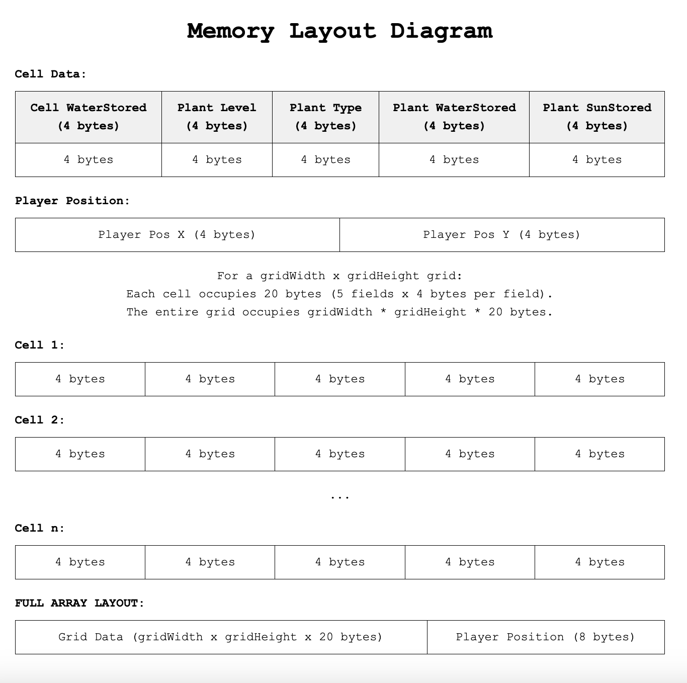

# How to build and deploy the project

1. Push a version that successfully runs
2. In the terminal, put "npm run build"
3. Push the changes
4. Check github actions and pages

# General Game Info:

- This is a 2D top-down gardening simulator with a simple control scheme reliant entirely on keypresses.
- The garden is organized in a 10 x 10 grid that the player can navigate through in individual steps.
- Each step also moves time forward by one time step which triggers environmental changes.
- Each cell receives a random amount of sun and water each time step but only stores the water.
- The player can sow a plant in each cell which will randomly be 1 of 3 available types of plants and the plants themselves store sunlight and water provided by the cell it inhabits each turn.
- Plants have 3 different available types that have different requirements for each to reach the next growth stage.
  - The maximum number of growth stages differ between plants and each plant has different sun and water requirements to progress to each stage.
  - All plants require at least 2 neighboring plants to be able to progress to the next possible stage.
- Upon reaching the maximum possible growth stage, the player can reap/harvest the plant when standing in the corresponding cell.
- The game reaches completion when the player can successfully reap 10 plants.

## Programming Practices:

- Tools used:
  - Github Actions
  - Prettier
  - Phaser (JavaScript Compatible Template)
  - Phaser (TypeScript Compatible Template)
  - Webpack to allow dev updates without changing the build

# Devlog Entry - 12/2/2024

## How we satisfied the software requirements

### F0+F1

- [F0.a]
  - You control a character moving over a 2D grid.
  - Same as last week.
- [F0.b]
  - You advance time manually in the turn-based simulation.
  - Same as last week.
- [F0.c]
  - You can reap or sow plants on grid cells only when you are near them.
  - Same as last week.
- [F0.d]
  - Grid cells have sun and water levels. The incoming sun and water for each cell is somehow randomly generated each turn. Sun energy cannot be stored in a cell (it is used immediately or lost) while water moisture can be slowly accumulated over several turns.
  - Same as last week.
- [F0.e]
  - Each plant on the grid has a distinct type (e.g. one of 3 species) and a growth level (e.g. “level 1”, “level 2”, “level 3”).
  - When we originally implemented this mechanic, plants were randomly assigned a type, and their growth was based on a fixed quantity of sun and water. We now define distinct plant types with configurable growth conditions, allowing each plant type to have its own unique requirements for sun, water, and neighboring plants. This adds flexibility to that plant system.
- [F0.f]
  - Simple spatial rules govern plant growth based on sun, water, and nearby plants (growth is unlocked by satisfying conditions).
  - The growth logic is now more flexible due to the Internal and External DSLs, allowing for customized conditions per plant species.
- [F0.g]
  - A play scenario is completed when some condition is satisfied (e.g. at least X plants at growth level Y or above).
  - The victory conditions are now changeable using the External DSL. This allows devs to set specific game scenarios and change the win conditions easily.
- [F1.a]
  - The important state of your game's grid must be backed by a single contiguous byte array in AoS or SoA format. If your game stores the grid state in multiple format, the byte array format must be the primary format (i.e. other formats are decoded from it as needed).
  - Same as last week.
- [F1.b]
  - The player must be able to manually save their progress in the game. This must allow them to load state and continue play another day (i.e. after quitting the game app). The player must be able to manage multiple save files/slots.
  - Same as last week.
- [F1.c]
  - The game must implement an implicit auto-save system to support recovery from unexpected quits. (For example, when the game is launched, if an auto-save entry is present, the game might ask the player "do you want to continue where you left off?" The auto-save entry might or might not be visible among the list of manual save entries available for the player to load as part of F1.b.)
  - Same as last week.
- [F1.d]
  - The player must be able to undo every major choice (all the way back to the start of play), even from a saved game. They should be able to redo (undo of undo operations) multiple times.
  - Same as last week.

### External DSL for Scenario Design

[F2.a]

**Pre-existing data language: JSON**

Our external DSL uses a human-readable format in JSON to allow designers to be able to easily adjust the conditions in the game, plant related settings and create unique gameplay scenarios.

**Structure**

The external DSL defines key components like weather, plant behavior, and victory conditions. The weather system includes randomized events (like "Rain Storm" or "Drought"), each with its own frequency and duration settings. The plant behavior section outlines their growth conditions. Lastly, the victory conditions specify how many plants of each type are required for success, as well as a general harvest target.

**Example Scenario**

```{
  "weather": {
    "random": true,
    "waterFrequency": 0.5,
    "sunFrequency": 0.5,
    "events": [
      {
        "name": "Rain Storm",
        "description": "No sun, lots of water",
        "sunFrequency": 0,
        "waterFrequency": 1,
        "scheduleTime": 10,
        "duration": 4
      },
      {
        "name": "Drought",
        "description": "Lots of sun, no water",
        "sunFrequency": 1,
        "waterFrequency": 0,
        "scheduleTime": 55,
        "duration": 8
      }
    ]
  },
  "plants": [
    {
      "type": 1,
      "waterRequired": 5,
      "sunRequired": 3,
      "neighborsRequired": 2,
      "maxLevel": 3
    },
    {
      "type": 2,
      "waterRequired": 3,
      "sunRequired": 5,
      "neighborsRequired": 1,
      "maxLevel": 4
    },
    {
      "type": 3,
      "waterRequired": 4,
      "sunRequired": 4,
      "neighborsRequired": 3,
      "maxLevel": 2
    }
  ],
  "victoryConditions": {
    "typeSpecific": {
      "type1": 10,
      "type2": 5,
      "type3": 5
    },
    "overallHarvest": 20
  }
}
```

**In Natural Language**

- **Weather:** The game features a randomized weather system. Initially, both water and sun are generated at a 50% chance. There are two scheduled weather events: a "Rain Storm" occurring at time 10 (lasting 4 time steps), which provides water but no sun, and a "Drought" starting at time 55 (lasting 8 time steps), which provides sun but no water.
- **Plants:** There are three types of plants, each with its unique requirements:
  - Type 1 needs 5 water, 3 sun, and 2 neighbors to grow. It can grow up to level 3.
  - Type 2 requires 3 water, 5 sun, and 1 neighbor, with a maximum growth level of 4.
  - Type 3 needs 4 water, 4 sun, and 3 neighbors to reach a max level of 2.
- **Victory Conditions:** The player wins if they harvest at least 10 plants of Type 1, 5 plants of Type 2, and 5 plants of Type 3, or achieve a total of 20 harvested plants.

### Internal DSL for Plants and Growth Conditions

[F2.b]

**Host Language: TypeScript**

Following is a code example showing how one could use our internalDSL in a Phaser-based game:

```// Internal DSL definition and usage
const plantDSL = InternalDSL.create();

// Define three plant types with distinct growth conditions
plantDSL
  .definePlantType(1, 8, 5, 2, 3) // Requires 8 water, 5 sunlight, 2 neighbors, max level 3
  .definePlantType(2, 5, 3, 2, 4) // Requires 5 water, 3 sunlight, 2 neighbors, max level 4
  .definePlantType(3, 10, 8, 2, 2); // Requires 10 water, 8 sunlight, 2 neighbors, max level 2

// Retrieve a plant type for spawning in a game cell
const randomPlantType = plantDSL.getRandPlantType();
```

**Explanation:**

In this, we are able to create three different types of plants that each have their own growth conditions. Afterwards, we can call the DSL to get a random plant type when we want to make any plant in the future.

This ensures that each plant has structurally unique conditions, such as in this example where:

- Plant 1 is focused on moderate water and sunlight.
- Plant 2 prioritizes balance but has a higher growth level.
- Plant 3 thrives in abundant resources but has a lower max level.

**Advantages of the Internal DSL**

Our project leverages an internal DSL (Domain-Specific Language) to define and manage plant types, weather configurations, and victory conditions dynamically. Below is an example of how our internal DSL integrates into the broader game logic:

```
// Internal DSL definition and usage
const settings = Settings.fromJSON(json); // Load configurations from JSON

// Plant definitions are dynamically added to the Internal DSL during initialization
settings.plants.forEach((plant) =>
  settings.InternalDSL.definePlantType(plant)
);

// Retrieve a plant type for spawning in a game cell
const randomPlantType = settings.InternalDSL.getRandPlantType();
```

the `getRandPlantType()` selects a `PlantConfig` object from the DSL's internal storage and passes it directly to the Plant constructor, which uses multiple TypeScript-specific features:

- **Dynamic and Type-Safe Object Creation:**
  The `getRandPlantType()` method selects a `PlantConfig` directly from the DSL's internal storage. This object is used immediately to create a plant in the `sow()` function, ensuring the plant is correctly instantiated:
  ```
  sow(): void {
  const type = this.plantTypes.getRandPlantType(); // Select a random plant type
  this.plant = new Plant(
    this.scene,
    this.y + this.cellSize / 2,
    this.x + this.cellSize / 2,
    type
  );
  this.updateIndicators();
  }
  ```

Overall, our internal DSL allowed us to make a plant system that could be easily modified while making plants that all had different growth conditions

### Switch to Alternate Platform

[F2.c]

**Javascript to Typescript**

We made the switch from Javascript to Typescript for a few reasons:

- It allowed us to ensure type safety, reducing the runtime errors.
- Gave us the chance to catch bugs at compile time instead of runtime
- Made code easier to write with better code completion

**How It Was Done**

What we carried over was the existing JavaScript logic, structures, and algorithms; as well as the Phaser 3 API as it supports both Javascript and Typescript.

When we created the original project, it was done using a Webpack Javascript template made by the Phaser team. They also had a Typescript template, which made the swapping process simpler, as we could update the preexisting files and then change the Javascript ones to Typescript.

That did not come without any problems, as we ran into a few. There were problems related to handling dynamic imports, identifying and correcting areas where implicit any types were used, and updating the development workflow to include TypeScript compilation.

In general, we did not have to change much about the previous concepts because of our preparation in F0.

## Reflection

### How the Switch Went

The switch went as smooth as we could have expected because of the preparation made at the beginning of the project. This is outlined in the section above, but in general we used a Phaser template that had equivalents in both Javascript and Typescript which allowed a near seamless swap.

### How the DSLs went

The DSLs required the most refactoring of our project. This caused us to change a lot of the F0 requirements to accommodate for both DSLs. We also got the chance to incorportate new patterns that we haven't worked with previously. We used json files, and added in a new weather system.

All in all, this step of the process was difficult, and due to the Thanksgiving break we were unable to meet the deadline; however, the changes we have made now are well implemented and impactful. We are hoping for the best going into the next and final step.

# Devlog Entry - 11/27/2024

## How we satisfied the software requirements

- [F0.a]
  - You control a character moving over a 2D grid.
  - Same as last week.
- [F0.b]
  - You advance time manually in the turn-based simulation.
  - Same as last week.
- [F0.c]
  - You can reap or sow plants on grid cells only when you are near them.
  - Same as last week.
- [F0.d]
  - Grid cells have sun and water levels. The incoming sun and water for each cell is somehow randomly generated each turn. Sun energy cannot be stored in a cell (it is used immediately or lost) while water moisture can be slowly accumulated over several turns.
  - Same as last week.
- [F0.e]
  - Each plant on the grid has a distinct type (e.g. one of 3 species) and a growth level (e.g. “level 1”, “level 2”, “level 3”).
  - Same as last week.
- [F0.f]
  - Simple spatial rules govern plant growth based on sun, water, and nearby plants (growth is unlocked by satisfying conditions).
  - Same as last week.
- [F0.g]
  - A play scenario is completed when some condition is satisfied (e.g. at least X plants at growth level Y or above).
  - Same as last week.
- [F1.a]
  - The important state of your game's grid must be backed by a single contiguous byte array in AoS or SoA format. If your game stores the grid state in multiple format, the byte array format must be the primary format (i.e. other formats are decoded from it as needed).
  - The SaveState implementation we have included stores the game's grid state in a single contiguous byte array formatted in **AoS** style. Each cell's data is serialized sequentially into this byte array. Anything that uses the grid decodes it from the load function created in the class. 
- [F1.b]
  - The player must be able to manually save their progress in the game. This must allow them to load state and continue play another day (i.e. after quitting the game app). The player must be able to manage multiple save files/slots.
  - The player is able to save their progress into multiple slots using the 1, 2, and 3 keys and pressing S and L. This allows the player to select a save file, save or load from it, and do the same with other saves. The StateManager writes a serialized version of the state to localStorage, which allows the game to be played even after reloading.
- [F1.c]
  - The game must implement an implicit auto-save system to support recovery from unexpected quits. (For example, when the game is launched, if an auto-save entry is present, the game might ask the player "do you want to continue where you left off?" The auto-save entry might or might not be visible among the list of manual save entries available for the player to load as part of F1.b.)
  - Every game action, such as sowing or reaping, automatically saves the game into the currently selected slot. This means that when the game is loaded from that slot it will load from the most recent save in that slot, which could either be the player's manual save, or an autosave
- [F1.d]
  - The player must be able to undo every major choice (all the way back to the start of play), even from a saved game. They should be able to redo (undo of undo operations) multiple times.
  - The StateManager holds a history of states, each added to the buffer when the game is saved. When the U key is pressed, the StateManager goes and loads the previous state in the history, going back to the beginning of the play session. If the player presses R, it goes back forwards into the history, which is written over once an action is made, effectively erasing the redo possibilites. If no more states are available to undo or redo, the system safely informs the player (e.g., "No more states to undo!").

## Reflection

Due to our time restrictions, we had scoped a super simple version of the project in the beginning. This allowed us to iterate swiftly on the small foundation we created in F0. That does not mean it was easy to get this up and running in time for the deadline, though. Some of the biggest changes we made were to force crunch on the team, since the deadlines required that we work outside of our normal hours and availability to get things shipped.

For game design, this week involved a lot of technical changes which did not leave a lot of room for scope change or expansion of our ideas. We only really had the chance to implement the mechanics required. It did give us the chance to think about the choice to use Phaser, and contemplate how we would go about switching to Typescript. Overall, the plan has become more focused on sticking to a small achievable scope that will allow us to adapt quickly to the short deadlines and refactoring that has happened and will continue to happen. We are preparing for more rounds of fast iteration.

# Devlog Entry - 11/21/2024

## How we satisfied the software requirements

- [F0.a]
  - You control a character moving over a 2D grid. The player jumps between spaces in the grid, aligning themselves with the grid space they are on. The player knows how big the cells are in the grid, and thus can move themselves one cell's-width when a movement key is pressed. They are also prevented from moving off of the screen
- [F0.b]
  - You advance time manually in the turn-based simulation. Time moves forwards when the player moves. We accomplish this by having a function in the Game scene that advances time forwards one step. When the player moves, they call that function and "step" forwards in time.
- [F0.c]
  - You can reap or sow plants on grid cells only when you are near them. When the player is standing on a cell they are able to sow or reap. There is only one input for the player. When they press the button the game will check if the cell is empty which would then sow a random type of plant into the sell. Otherwise, it would check if the plant is at max level. If it is then it’ll allow the player to reap the plant. This increases a counter at the moment, counting how many plants have been reaped
- [F0.d]
  - Grid cells have sun and water levels. The incoming sun and water for each cell is somehow randomly generated each turn. Sun energy cannot be stored in a cell (it is used immediately or lost) while water moisture can be slowly accumulated over several turns. The grid manager randomly generates 0-5 water or 0-1 sun for each cell every timestep. When a cell receives water, it adds it to storage. Then, it checks if the plant needs any water and gives it 1 water if needed. The plant will only take 1 sun and 1 water per timestep. When the cell receives sun, it’ll check if the plant needs sun. If it doesn’t, then the sun disappears; otherwise, it gives it to the plant.
- [F0.e]
  - Each plant on the grid has a distinct type (e.g. one of 3 species) and a growth level (e.g. “level 1”, “level 2”, “level 3”). Each plant is randomly any one of the three species. These plants each have a different sprite set associated with them, shown through emojis. As the plant levels up, the sprite changes to match the plant's level. Each type of plant has it's own different quantity of sun and water to level up.
- [F0.f]
  - Simple spatial rules govern plant growth based on sun, water, and nearby plants (growth is unlocked by satisfying conditions).Each plant must reach its maximum amount of sun and water to level up. The plant absorbs water from the cell it is in 1 every time step, and the same is true for sun. When the plant reaches its max in both, it will grow the next time step. This change is visible through the emoji sprites placed in the cell. Spacially, the plants can only grow if there is more than 1 adjacent plant in the North, South, East or West directions. As such, plants must be planted nearby eachother to grow.
- [F0.g]
  - A play scenario is completed when some condition is satisfied (e.g. at least X plants at growth level Y or above). The win condition for ours is that the player must reap 10 plants before they complete the play scenario. After which, the player is taken to an end screen.

## Reflection

When we first met up to plan for this assignment, we had multiple different views as to how the player would move in the grid. Originally, the player would have free movement in all directions, though this ended up changing to the system we have now. We decided on this as it would simplify the process for setting up our planting system, and we could easily keep track of what cell the player was in.

The project was first made without the use of any code formatter, which we changed soon into the process by using Prettier. We also started using a build system through webpack that allows us to push changes to the project without changing the build that goes to Github Pages.

The majority of technical changes came in the Plant system, where we refactored how the Grid, Cells, and Plants all communicated. Our route we took was to avoid having things further down the tree (plants) communicate with things that were holding them (Cells).

# Devlog Entry - 11/14/2024

## Introducing the team

Garrett Blake as Tools Lead  
Sunny Han as Engine Lead  
Katrina VanArsdale as Design Lead  
Lia Cui as Assistant to Engine and Design

## Tools and Materials

### Engines, libraries, frameworks

Phaser 3 is our game engine of choice, as it will help us to make a web game and can be easily adapted for any changes we may need to make. Our approach allows us to use and relearn an engine we all have some experience in, while giving room for us to experiment in other aspects of the project.

### Programming languages

We will be using Phaser 3 API along with JavaScript as Phaser is a web-based game engine. Consequently, because we are using a web-based game engine we will also be using HTML and CSS albeit very minimally. On the likely chance that we wil use Sprite Atlases, we will likely also use JSON to organize sprite atlas information. Moving forward in our alternate platform, we would like to switch the main programming language from JavaScript to TypeScript.

### Tools

The main IDE for writing code that we will all use is Visual Studio Code which we are all comfortable with. With visual assets, there are a variety of possibilities but it is very likely that Aseprite will be used for pixel art and sprites. We all know how to make pixel art and can do art to some degree so any art program is comfortable for us to use. For version control, we are also using GitHub because that is the expected version control tool.

### Alternate Platform

Our alternate primary programming language is TypeScript which supports web functionality but with stricter types. Phaser 3 should support TypeScript which means we can still use Phaser 3 to build our game.

## Outlook

Our team is hoping to make a project of reasonable scope that we feel that can be accomplished giving the time frame and available resources. The hardest anticipated part of this project is switching frameworks and getting comfortable in both languages. We are hoping to expand our understanding of creating clean, readable, and scalable code in a team setting.
